# Code-to-Code Translation with CodeT5+

This repository contains the code and evaluation results for our project on code-to-code translation using the CodeT5+ model[[1]](#1). Our primary focus is on the evaluation of the CodeT5+ 220M model in the domain of code-to-code translation with a dataset[[2]](#2) comprising equivalent code snippets in C# and Java.

## Overview

Despite initial plans to train and evaluate our own transformer architecture, we concentrated our efforts on thoroughly evaluating the pretrained CodeT5+ 220M model. This model had not been previously evaluated in the domain of code-to-code translation and was not trained on our specific dataset.

We evaluated three different versions of the CodeT5+ model:
1. The unmodified CodeT5+ model.
2. The CodeT5+ model trained from scratch with our dataset.
3. The CodeT5+ model fine-tuned on our dataset.



Among these, the fine-tuned version showed the best results. Additionally, we compared these results with other models[[2]](#2) evaluated on the same dataset, and the fine-tuned CodeT5+ model outperformed them, despite being the smallest in size at 220M parameters.

## Repository Contents

- `data/`: Directory containing the dataset used for training and evaluation.
- `models/`: Directory containing scripts to load and evaluate the different versions of the CodeT5+ model.
- `notebooks/`: Jupyter notebooks used for training, fine-tuning, and evaluation of the models.
- `results/`: Directory containing the evaluation results, including BLEU and CodeBLEU scores.
- `src/`: Source code for training and evaluating the transformer models.

## Results

The evaluation results, including BLEU and CodeBLEU[[3]](#3) scores, can be found in the results/ directory. Our analysis shows that the fine-tuned CodeT5+ model achieves the best performance on the code-to-code translation tasks.

|     Method     |    BLEU    |  CodeBLEU |
|    ----------  | :--------:  | :-------: |
| Naive copy[[2]](#2)     |   18.54     |      -    |
| PBSMT[[2]](#2)      	 |   43.53    |   42.71   |
| Transformer[[2]](#2)    |   55.84    |   63.74   |
| Roborta (code)[[2]](#2) |   77.46    |   83.07   |
| CodeBERT[[2]](#2)   	 | 79.92 | 85.10 |
| LLaMA3 8B (zero-shot-prompting) | 49.07 | 35.79 |
|CodeT5+ 220M | 0.0 | 13.31 |
|CodeT5+ 220M self trained | 0.0 | 20.49 |
|CodeT5+ 220M fine-tuned| **98.44** | **87.55** |


## Conclusion

Our project demonstrates the effectiveness of the CodeT5+ 220M model for code-to-code translation, particularly when fine-tuned on a specific dataset. The fine-tuned model not only outperforms the unmodified and from-scratch trained versions but also surpasses other models evaluated on the same dataset.

## License

This project is licensed under the MIT License - see the [LICENSE](LICENSE) file for details.

## Contact

Feel free to explore the repository and use the provided scripts and notebooks to replicate our experiments or build upon our work. For any questions or feedback, please open an issue or contact us directly.

## References
<a id="1">[1]</a> 
Wang, Y., Le, H., Gotmare, A. D., Bui, N. D., Li, J., & Hoi, S. C. (2023). Codet5+: Open code large language models for code understanding and generation. arXiv preprint arXiv:2305.07922. [paper](https://arxiv.org/pdf/2305.07922.pdf) | [code](https://github.com/salesforce/CodeT5/tree/main/CodeT5+) | [model](https://huggingface.co/models?sort=downloads&search=codet5p) | [blog](https://blog.salesforceairesearch.com/codet5-open-code-large-language-models/)

<a id="2">[2]</a> 
Lu, S., Guo, D., Ren, S., Huang, J., Svyatkovskiy, A., Blanco, A., ... & Liu, S. (2021). Codexglue: A machine learning benchmark dataset for code understanding and generation. arXiv preprint arXiv:2102.04664. [paper](https://doi.org/10.48550/arXiv.2102.04664) | [dataset](https://huggingface.co/datasets/google/code_x_glue_cc_code_to_code_trans)

<a id="3">[3]</a>
Ren, S., Guo, D., Lu, S., Zhou, L., Liu, S., Tang, D., ... & Ma, S. (2020). Codebleu: a method for automatic evaluation of code synthesis. arXiv preprint arXiv:2009.10297. [paper](https://doi.org/10.48550/arXiv.2009.10297)

<a id="4">[4]</a> 
Wang, Y., Wang, W., Joty, S., & Hoi, S. C. (2021). Codet5: Identifier-aware unified pre-trained encoder-decoder models for code understanding and generation. arXiv preprint arXiv:2109.00859. [paper](https://arxiv.org/pdf/2109.00859.pdf) | [code](https://github.com/salesforce/CodeT5/tree/main/CodeT5) | [model](https://huggingface.co/models?sort=downloads&search=codet5) | [model card](https://github.com/salesforce/CodeT5/blob/main/CodeT5/CodeT5_model_card.pdf) | [blog](https://blog.salesforceairesearch.com/codet5/) 


# code-to-code
We want to look into the domain of machine translation of programming languages. With this project, we aim to train a pre-trained model in for the translation of Java code and C# code. After that, we will build our own model from scratch (using PyTorch or TensorFlow). Both approaches will be evaluated at the end.

## Dataset
[`code_x_glue_cc_code_to_code_trans`](https://huggingface.co/datasets/google/code_x_glue_cc_code_to_code_trans)

## Performance
Java to C#:
|     Method     |    BLEU    | Acc (100%) |  [CodeBLEU](https://github.com/microsoft/CodeXGLUE/blob/main/Code-Code/code-to-code-trans/CodeBLEU.MD) |  
|    ----------  | :--------: | :-------:  | :-------: |
| Naive copy     |   18.54    |    0.0     |      -    |
| PBSMT      	 |   43.53    |   12.5     |   42.71   |
| Transformer    |   55.84    |   33.0     |   63.74   |
| Roborta (code) |   77.46    |   56.1     |   83.07   |
| CodeBERT   	 | **79.92**  | **59.0**   | **85.10** |


## BLEU score
BLEU score of pre-trained code-t5p
```json
{'bleu': 0.27616698787238064, 'precisions': [0.4172661870503597, 0.2961165048543689, 0.23955773955773957, 0.19651741293532338], 'brevity_penalty': 1.0, 'length_ratio': 1.774468085106383, 'translation_length': 834, 'reference_length': 470}
```
BLEU score of 1 epoch optimied model
```json
{'bleu': 0.3360167248253018, 'precisions': [0.48464619492656874, 0.35859269282814615, 0.2962962962962963, 0.24756606397774686], 'brevity_penalty': 1.0, 'length_ratio': 1.5936170212765957, 'translation_length': 749, 'reference_length': 470}
```
